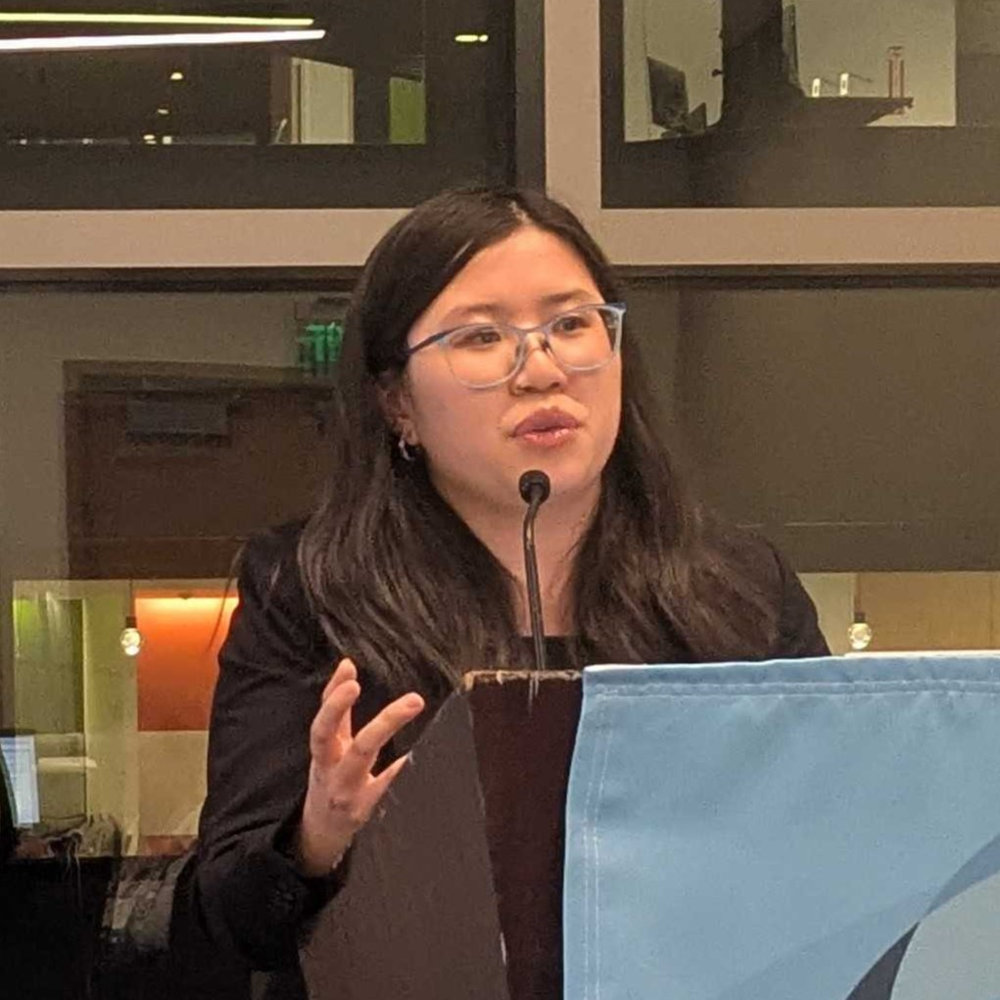
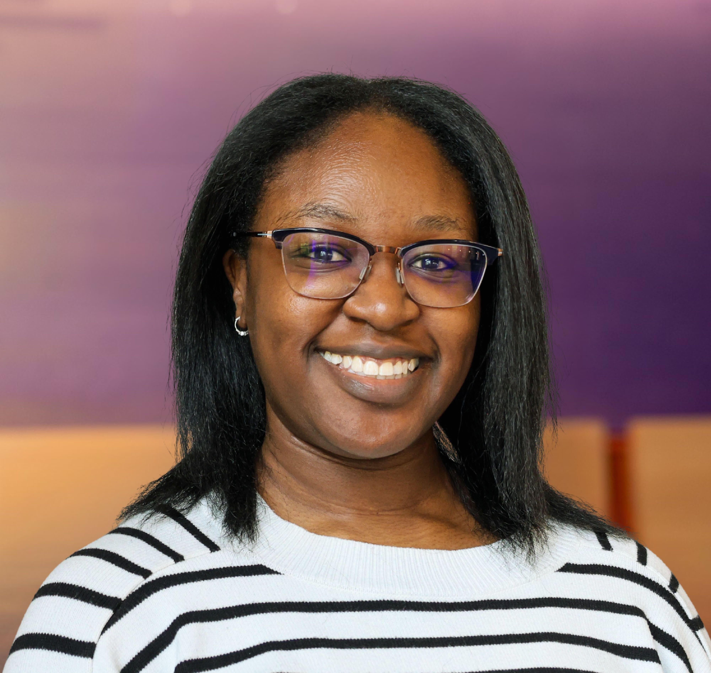
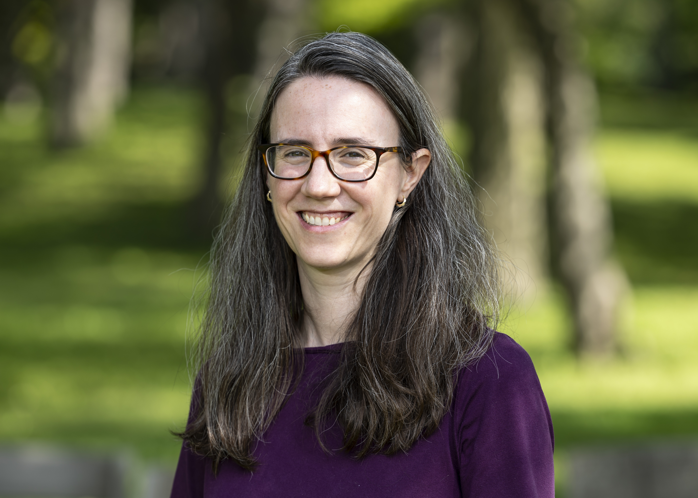

---
# Feel free to add content and custom Front Matter to this file.
# To modify the layout, see https://jekyllrb.com/docs/themes/#overriding-theme-defaults

layout: default
---

# Personal Project Workshop

_Not sure how to get started on a personal project? Join our workshop to get support from facilitators and peers!_

May 30-31, 2026 @ 12-5 PM

Mudd Library, Northwestern University 

**Applications accepted on a rolling basis, due May 26!**



-----

**Are you interested in working on a personal programming project, but unsure about how to get started?** Consider signing up for our research study: a hands-on workshop on May 30 and 31 from 12-5 PM to 

1. Learn skills for working on a larger programming project from start to finish and  
2. Get support and feedback from your peers and graduate students as you work!

**This workshop is designed for anyone who has minimal or introductory experience in the Python programming language** and is intended to be useful for anyone looking to build up a software engineering portfolio, build up their programming skills, create something interesting and cool, and more!

Lunch and snacks will be provided during the workshop. Attendees will receive a $70 gift card for attending both days. 

## Learning Objectives
{: #learning-objectives}

By the end of this workshop, attendees will know how to:

* Brainstorm an implementation for a personal project
* Decompose an idea into a system made up of models, views, and controllers (MVC)  
* Document the functionality of each part of the system  
* Prepare test cases for each part of the system  
* Implement the models, views, and controllers in the system  
* Use strategies to debug effectively

## Interested?



Apply by **May 26, 2026** at 11:59 PM! Acceptances will be sent out on a rolling basis. The workshop location details will be sent to you upon acceptance. 

Those who fill out the application in good faith will be compensated with a $10 gift card. 

This workshop is a part of a research study approved by Northwestern's IRB: _STU00226229: Designing programming problem solving support for students_ (PI: Dr. Eleanor O'Rourke).

## Schedule
{: #schedule}

| Time | Activity |
|------|----------|
| **Day 1** | |
| 12:00 - 1:30 PM | lunch + getting started on your project |
| 1:30 - 4:00 PM | work time w/ support from facilitators and peers |
| 4:00 - 5:00 PM | reflections + next steps |
| **Day 2** | |
| 12:00 - 3:00 PM | lunch + work time w/ support from facilitators and peers |
| 3:00 - 3:30 PM | project gallery walk + feedback |
| 3:30 - 4:30 PM | reflections |
| 4:30 - 5:00 PM | talking about your project in your portfolio, to recruiters, etc.; wrap-up + next steps |

## Organizers
{: #organizers}

### Melissa Chen _(she/her)_

[Melissa Chen](https://melissaychen.com/) is a fourth year PhD candidate in Computer Science at Northwestern University. Her research explores how to design sociotechnical learning environments to support student learning and confidence in computing education. Prior to her PhD, she graduated from the University of Illinois at Urbana-Champaign with a BS in computer science and a minor in math, where she was on course staff for the project-based Freshman Honors Seminar for two semesters and Computer Architecture for five semesters, taught coding workshops through Women in Computer Science and Girls Who Code, and completed software engineering internships at Facebook, Lyft, and the National Center for Supercomputing Applications. 

### Mora Labisi _(she/her)_

[Mora Labisi](https://themoralcode.org/) is a second-year Computer Science + Learning Sciences PhD Student at Northwestern University and a NSF CSGrad4US Fellow. Her work focuses on understanding how to support undergraduate Computer Science students as they navigate the transition from academia to industry. Prior to embarking on her Ph.D. journey, Mora worked as a Software Engineer at Starbucks for a little over four years.

### Eleanor O’Rourke _(she/her)_

[Eleanor "Nell" O'Rourke](http://eleanorourke.com/) is an Associate Professor in Computer Science and the Learning Sciences at Northwestern University, where she co-directs the interdisciplinary Delta Lab. Her research explores the design of novel computational systems to support motivation and learning in STEM domains. Recent projects include studying student beliefs about programming ability in introductory computer science courses, designing game mechanics that encourage students to practice effective problem-solving skills, and developing web inspection tools that allow novice developers to learn directly from authentic professional websites. Her interventions have been used by over 100,000 students online, adopted by companies, and integrated into classrooms. Her work has been recognized through an NSF CAREER Award, a Google Systems Research Award, and best paper awards and nominations at SIGCSE, UIST, and CHI.

## Contact
{: #contact}

**Questions?** Email: melissac [at] u [dot] northwestern [dot] edu with with "Personal Project Workshop" in the subject line.
